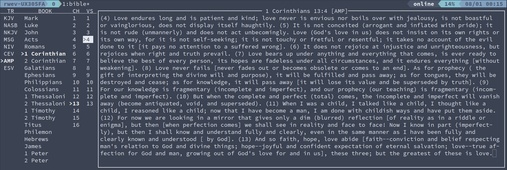

# Bible
Read the Bible with python and curses.



## Installation
```shell
$ pip install https://github.com/rwev/bible/archive/master.zip
```

## Usage 
```shell
$ bible
```
Use the arrow keys to navigate and make selections. 

## Development
```shell
/resurgence $ pip install http://github.com/rwev/resurgence/archive/master.zip
/resurgence $ resurgence -w -x "python main.py -t .py"
```

## TODO
- compress translation files
- select desired translations during installation
- add bookmarking
- add vim keybindings
- fuzzy-finder in selection windows
